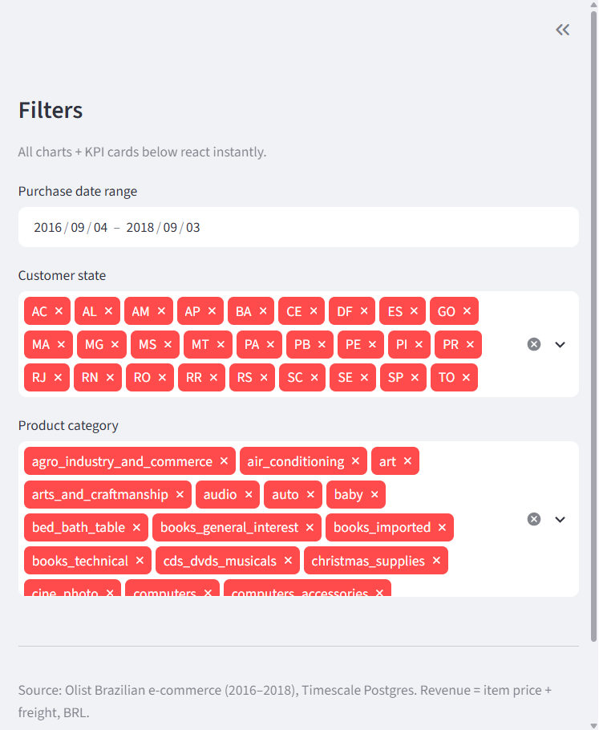
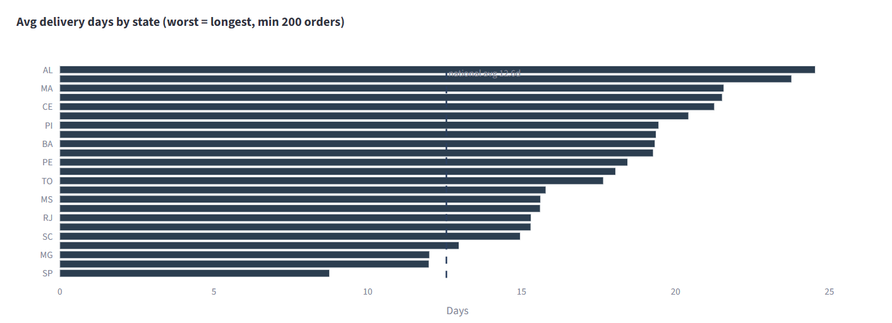
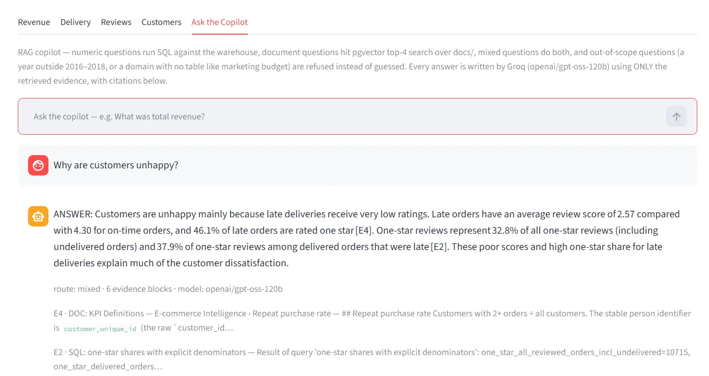
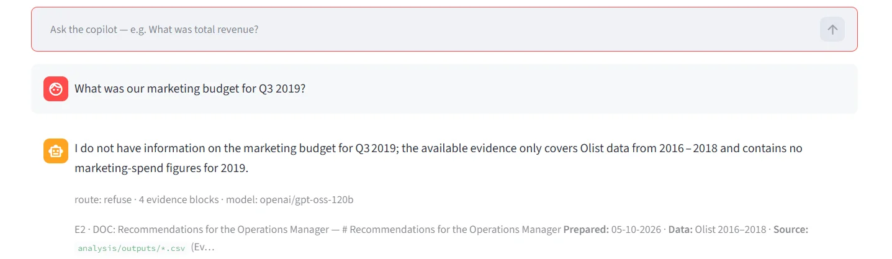
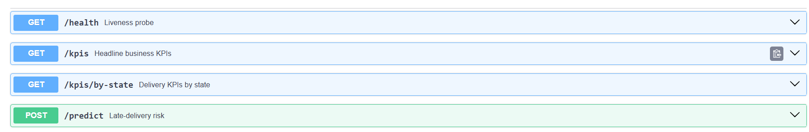

# E-commerce Revenue & Customer Experience Intelligence Copilot

**A full-stack analytics project: raw CSVs → SQL star-schema warehouse → BI dashboard → ML risk model → REST API → cited RAG copilot — built on the Olist Brazilian e-commerce dataset (2016–2018, ~100k orders, BRL).**

## The business problem

An online marketplace seller sees revenue but suspects customers are unhappy: orders arrive late and buyers rarely purchase again. Leadership has no data-backed view of *where* the experience breaks down or *what it costs*. This project answers the Operations Manager's three questions — where delivery fails, whether lateness drives bad reviews, and how revenue splits between repeat and one-time buyers — and turns the answers into three quantified recommendations.

## Architecture

```
 raw CSVs (Olist, 9 files, 2016–2018)
        │
        ▼
 ┌──────────────┐     scripts/etl.py — clean, dedupe, type, load
 │  ETL (pandas)│────► star schema in Postgres (Timescale Cloud)
 └──────────────┘      │  fact_orders (112,650 rows) + 6 dims
                       │  pgvector extension for document embeddings
                       │
        ┌──────────────┼──────────────────┐
        ▼              ▼                  ▼
 ┌────────────┐  ┌────────────┐   ┌─────────────────────┐
 │ Streamlit  │  │  FastAPI   │   │   RAG copilot       │
 │ dashboard  │  │  REST API  │   │ router → SQL /      │
 │ (5 tabs)   │  │ /docs      │   │ pgvector → Groq LLM │
 └────────────┘  └────────────┘   └──────────┬──────────┘
                                             ▼
                                   openai/gpt-oss-120b
                                   (Groq, cited answers)
```

## Star schema (ERD)

```
dim_customers ─┐                    ┌─ dim_products
  customer_id  │                    │  product_id
  customer_unique_id                │  product_category_en
  customer_state                    │  weight / L / H / W
               ├──────────► fact_orders ◄──────────┤
dim_sellers ───┤   (order_id, order_item_id)       │
  seller_id    │        │                          │
  seller_state │        ├── customer_id  (FK)      │
               │        ├── product_id   (FK)      │
dim_date ──────┘        ├── seller_id    (FK)      │
  date_key              ├── purchase_date_key (FK) │
  full_date, year,      ├── price, freight_value   │
  month, quarter,       ├── delivery_days          │
  day_of_week           ├── is_delivered, is_on_time
                         └── review_score
dim_reviews ────► (order_id, review_score, comments, dates)
dim_payments ───► (order_id, payment_sequential, type, value)

rag_documents (id, title, content, embedding vector(384))   ← pgvector
```

Grain of `fact_orders`: **one row per order item** (PK `order_id + order_item_id`). Order-level KPIs collapse to one row per order first, so multi-item orders are never double counted. `dim_customers` carries both the order-scoped `customer_id` and the stable `customer_unique_id` used for repeat-purchase analysis.

## Key findings

Every number traces to a CSV in `analysis/outputs/` (produced by `analysis/eda.py`) — see [`analysis/recommendations.md`](analysis/recommendations.md) for full sourcing.

| # | Finding | The numbers |
|---|---|---|
| 1 | **Delivery failure is regional.** Six Northeast states drag far below the national line — and they're slow on top of it. | National on-time **91.89%**, 12.6 days avg. Worst: **AL 76.1% / 24.5 days** (11.9 days slower than national), then MA 80.3%, PI 84.0%, CE 84.7%, SE 84.8%, BA 86.0% → **492 excess late orders** above benchmark. |
| 2 | **Lateness poisons public ratings** — the single largest identifiable source of 1-star reviews. | Late orders average **2.57★ vs 4.30★** on-time. **46.1%** of the 7,620 reviewed late orders got 1 star — **3,512 one-star reviews** — **32.8% of ALL 1-star reviews** come from late deliveries alone (3,512 / 10,715). |
| 3 | **The marketplace is structurally one-time.** Repeat customers are worth ~1.9× but are rare. | Repeat rate **3.05%** (2,913 / 95,420 customers). One-time buyers drive **94.3%** of revenue (14.94M BRL). Revenue/customer: **~310 BRL repeat vs ~161 BRL one-time**. Top-10 categories = **9,874,221 BRL ≈ 62%** of revenue. |

Headline KPIs (live from the warehouse): **15,843,553 BRL revenue · 91.89% on-time · 4.11/5 avg review · 3.05% repeat rate.**

## Tech stack

| Layer | Technology |
|---|---|
| Language | Python 3.14 |
| ETL / analysis | pandas 3.0, NumPy 2.5 |
| Warehouse | PostgreSQL (Timescale Cloud) + pgvector, SQLAlchemy 2.1, psycopg2 2.9 |
| BI dashboard | Streamlit 1.65 + Plotly |
| REST API | FastAPI 0.142 + Uvicorn 0.54, Pydantic |
| ML | scikit-learn 1.9 (RandomForest, LogisticRegression), joblib |
| RAG / LLM | sentence-transformers 6.1 (`all-MiniLM-L6-v2`, 384-dim, local), Groq SDK (`openai/gpt-oss-120b`) |
| Config | python-dotenv (secrets stay out of git) |

## Run it locally

**1. Clone and create a virtual environment**

```bash
git clone https://github.com/NitishPoosarla/ecommerce-copilot.git
cd ecommerce-copilot
python -m venv venv
# Windows:
venv\Scripts\activate
# macOS/Linux:
source venv/bin/activate
```

**2. Install dependencies**

```bash
pip install pandas numpy sqlalchemy psycopg2-binary streamlit plotly \
            fastapi uvicorn scikit-learn joblib sentence-transformers \
            groq python-dotenv
```

**3. Create `.env` in the repo root** (never commit it — `.gitignore` blocks it)

```env
DATABASE_URL=your-postgres-connection-string-here
GROQ_API_KEY=your-groq-api-key-here
```

> Get `DATABASE_URL` from your Postgres provider (must support the `pgvector` extension). Get a free `GROQ_API_KEY` at [console.groq.com](https://console.groq.com). Neither value belongs in git.

**4. Load the data and build the warehouse**

```bash
# put the 9 Olist CSVs in Data/Raw/ (Kaggle: "Brazilian E-Commerce Public Dataset by Olist")
python scripts/etl.py          # creates star schema + loads all tables
python scripts/validate.py     # 5 sanity checks that must pass
python scripts/run_queries.py  # the 15 documented KPI queries
```

**5. Analysis, model, and copilot index**

```bash
python analysis/eda.py         # writes analysis/outputs/*.csv
python ml/train_model.py       # trains + saves ml/model.joblib
python -m copilot.ingest       # chunks docs/ and embeds into pgvector
```

**6. Start the apps**

```bash
streamlit run app.py                                      # dashboard → http://localhost:8501
python -m uvicorn api.main:app --port 8000                # API → http://localhost:8000/docs
python -m copilot.copilot "What was total revenue?"       # one-shot copilot question
python -m copilot.test_questions                          # 9-question regression suite (exit 0 = pass)
```

## Screenshots

| Screenshot | File |
|---|---|
| Dashboard — KPI cards |  |
| Dashboard — delivery by state |  |
| Copilot answer with citations |  |
| Copilot refusal (marketing budget Q3 2019) |  |
| FastAPI Swagger UI |  |

## Limitations (stated honestly)

- **Historical data (2016–2018)** — decision support, *not* real-time forecasting. Logistics and carriers have changed since.
- **No marketing-spend data** — no ad ROI analysis, and no ROI claims are made anywhere in this project.
- **Correlations, not causes** — the analysis shows *what* co-occurs; it cannot prove *why* an order was slow (no route, weather, or carrier data).
- **Churn modeling is not credible** at a 3.05% repeat rate — which is why ML is used only for late-delivery risk, with order-time features only.
- **Class imbalance** — 7.9% of delivered order items were late. Accuracy alone would be misleading (an "always on-time" guesser scores 92.1%); the model card reports ROC-AUC and band precision instead.
- **Model is advisory** — uncalibrated tree votes, deliberately high-precision/low-recall at the 0.30 alert cut (61.5% of flagged orders truly late = 8× lift over base rate; catches 12.4% of late orders). Not an SLA, not customer-facing.
- **Copilot guardrails are guardrails, not proofs** — keyword routing can misroute a rephrased question; top-4 retrieval can miss a section; the number audit catches numbers absent from evidence but not a number attached to the wrong entity.
- **All revenue-impact figures are arithmetic projections from observed averages, not forecasts.**

## What I learned

**The most valuable thing I built wasn't the pipeline — it was the QA layer that keeps the pipeline honest.**

- **The denominator audit.** Early draft answers said things like *"32.8% of reviews come from late deliveries."* True-sounding, and wrong: the same numerator (3,512 late one-star reviews) yields **32.8% of ALL one-star reviews** (3,512/10,715, including undelivered orders) or **37.9% of one-star reviews on delivered orders only** (3,512/9,258) — two different claims, one number. The copilot now runs a second SQL block that returns *both* denominators explicitly, the prompt requires every `X% of …` claim to name its population and scope, and a parser-side `missing_denominator` audit flags any percentage that slips through without one. The dashboard surfaces the flag as a warning instead of hiding it.

- **The refusal route.** Asked *"What was our marketing budget for Q3 2019?"* — a fact that exists in no table and no document — the copilot must say it doesn't have that information rather than invent a plausible figure. Making that deterministic took two pieces: a `refuse` route in the router (any year outside 2016–2018, or a domain with no table at all like marketing/budget/salary, skips SQL entirely and sends Groq an explicit scope note saying the evidence *cannot* answer the question), and an audit exemption so that quoting the user's own question back (*"no marketing spend for 2019"*) isn't flagged as an invented number. Invention attempts now fail at three independent layers: routing, prompt rules, and the number audit.

- **The 9-question regression suite.** Every claim above is protected by `copilot/test_questions.py`: nine real questions covering numeric, document, mixed, and refusal routes, each checked for the right route, real citations, no invented numbers, no bogus `[E#]` references, and explicit denominators. It exits non-zero on any flag, so "the copilot still works" is a command, not a hope. Hardening the denominator and refusal behavior surfaced a subtle audit bug (a trailing period made `2019.` ≠ `2019`) that only the suite caught — exactly the kind of thing a code review misses and a regression test doesn't.

The broader lesson: **trust in a data product is manufactured by small, boring, repeated checks** — validation scripts that must pass, metrics that admit class imbalance, a model card that lists what the model *cannot* do, and an answer engine that cites its sources or admits it has none.

## License

MIT — see [LICENSE](LICENSE).
